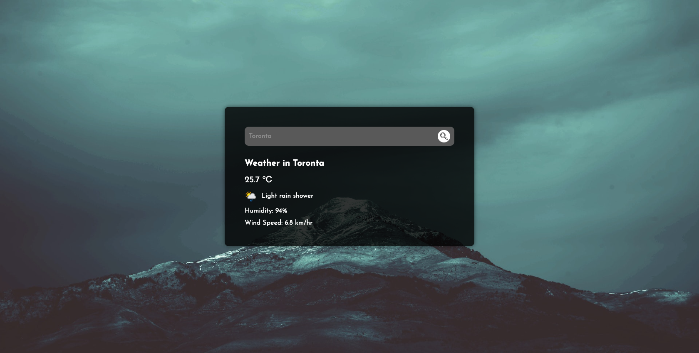

# Weather Condition Check App

This is a React based app that lets users search for their needed location (Based on location, ZIP code, and IP) weather condition. At this point (May 7, 2023) it only searches for the current weather condition, however, in the near future there will be more modification as follows:

- Weather Forcast
- Option modification based on Language and measurment units

## Table of contents

- [Overview](#overview)
  - [The challenge](#the-challenge)
  - [Screenshot](#screenshot)
  - [Links](#links)
- [My process](#my-process)
  - [Built with](#built-with)
- [Author](#author)

## Overview

### The challenge

There were some tiny challenges throughout the design and development process:

- Using API Keys along with Axios library for sending HTTP requests to the weatherapi.com
- Using Loading Spinner Library for better UX
- Error Handling based on the Error Types

### Screenshot

### Links

- [Live Site URL](https://shayan-weather.netlify.app/)

## My process

### Built with

- Semantic HTML5 markup
- CSS custom properties
- Flexbox
- Mobile-first workflow
- [React](https://reactjs.org/) - JS library
- [Axios Library] (https://www.npmjs.com/package/axios)
- [React Loader Spinner Library] (https://www.npmjs.com/package/react-loader-spinner)

## Author

- Website - [Shayan Faghihi](https://shayan-faghihi.ir)
- Frontend Mentor - [@SHayanFaghihi](https://www.frontendmentor.io/profile/ShayanFaghihi)
- LinkedIn - [@shayanfaghihi](https://www.linkedin.com/in/shayanfaghihi/)
